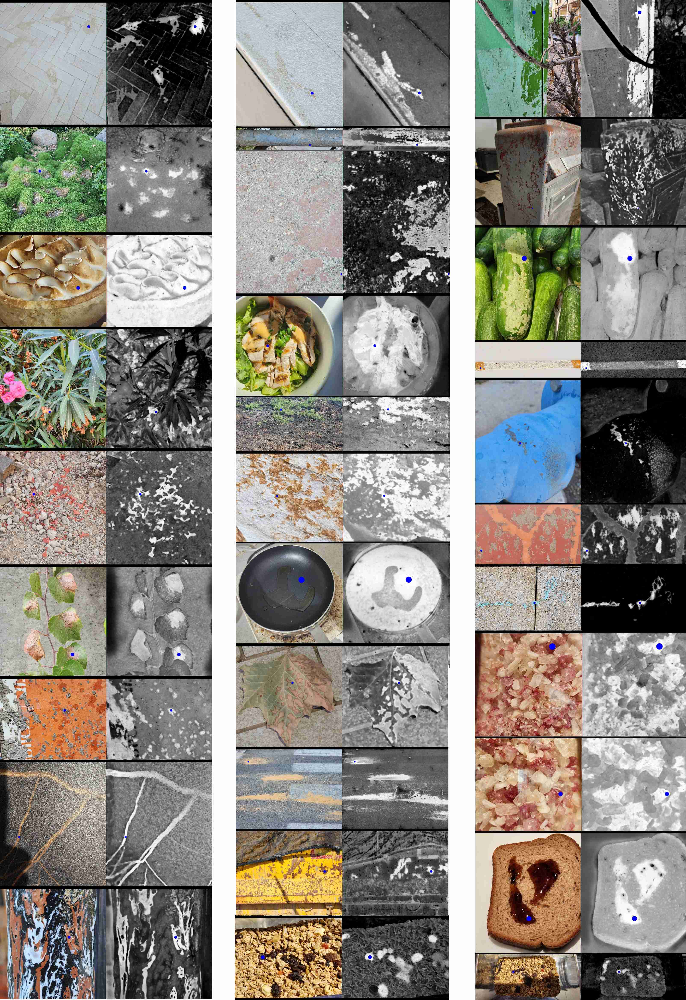
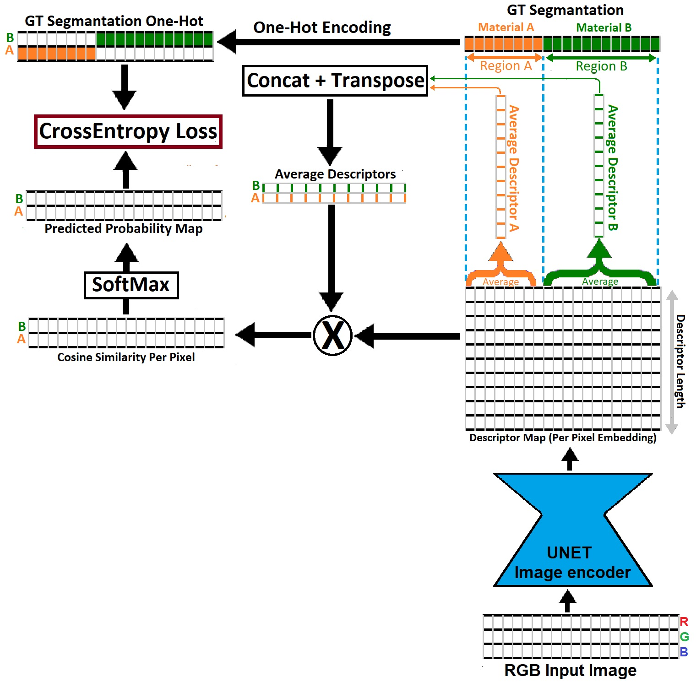

# Zero-Shot Material State Segmentation Net
Net trained on a MatSeg net for Zero-Shot/Class-Agnostic Material state segmentation from the image.
Predict descriptor per pixel. This descriptor describes how similar the material in a given point is to the material in any other region of the image(Figure 1)
And can be used to generate a segmentation map or similarity map for the materials in an

See [Learning Zero-Shot Material States Segmentation,
by Implanting Natural Image Patterns in Synthetic Data](https://arxiv.org/pdf/2403.03309.pdf).

#### PreTrained model can be downloaded from these URLs [1](https://e.pcloud.link/publink/show?code=XZlkH9ZVr34Vk4oV9LQGkseAyMJXpbRDui7) , [2](https://icedrive.net/s/b75b61y8VSagutiYi1FZQSQhQVtZ) and copy into logs/ folder
#### The net was trained on the MatSeg dataset that can be downloaded from [1](https://e.pcloud.link/publink/show?code=kZHCcnZOfzqInb3anSl7xzFBoqCDmkr2JKV),[2](https://icedrive.net/s/SBb3g9WzQ5wZuxX9892Z3R4bW8jw),[3](https://zenodo.org/records/10801191).
#### Sample data is supplied in the subfolder: samples
 

# Requirement:

Torch: [https://pytorch.org/](https://pytorch.org/)

OpenCV: [pip install opencv-python](https://pytorch.org/)

The net was trained on a single RTX 3090.

# Running Demo
Train or download pretrained model  from one of these urls [1](https://e.pcloud.link/publink/show?code=XZlkH9ZVr34Vk4oV9LQGkseAyMJXpbRDui7) , [2](https://icedrive.net/s/b75b61y8VSagutiYi1FZQSQhQVtZ) and copy into logs/ folder

run: python Demo.py

output: This should display the segmentation map and material similarity map for a selected point in the test image (supplied).

(see input parameters for modifying input)

# Train:
Download MatSeg dataset one of these URLs [1](https://e.pcloud.link/publink/show?code=kZHCcnZOfzqInb3anSl7xzFBoqCDmkr2JKV),[2](https://icedrive.net/s/SBb3g9WzQ5wZuxX9892Z3R4bW8jw),[3](https://zenodo.org/records/10801191).

run: python --data_dir "path to the MatSeg Dataset"

output: trained model weights will be saved in the /log folder.

Sample data are supplied with the code which should allow the model to run out of the box.

# Test on the MatSeg Benchmark
Download the MatSeg Benchmark from one of these urls [1](https://icedrive.net/s/NtbARDSx6WtSN748Z7kix8ZXZtSu),[2](https://e.pcloud.link/publink/show?code=XZDsGnZ3ERMX76L5dYLzfnPTch8fYRtlRXV),[3](https://zenodo.org/records/10801191):

run Evaluate --images_dir "MatSeg benchmark image dir" --data_dir "MatSeg Benchmark data dir"

Results will be displayed on the screen

## Results of Trained Model

## Training Diagram

see [Learning Zero-Shot Material States Segmentation,
by Implanting Natural Image Patterns in Synthetic Data](https://arxiv.org/pdf/2403.03309.pdf).

